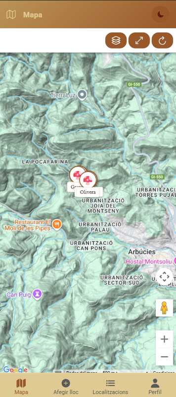

# 🍄 Mushroom Finder


<table>
  <tr>
    <td></td>
    <td></td>
    <td></td>
  </tr>
</table>

A hybrid app to discover, save, and share mushroom locations. Includes map, photos, weather, notifications, and offline support.

**Live demo:** [https://boletus-eb305.web.app](https://boletus-eb305.web.app)

You can visit the app in your browser or install it on your device (PWA: click the install icon in your browser).

## Tech Stack

- Ionic React + TypeScript
- Vite
- Firebase (Firestore, Auth, Storage, Hosting)
- Google Maps API
- OpenWeather API

## Main Features

- Interactive map (Google Maps)
- Save locations with photos
- Weather forecast for locations
- Proximity notifications
- Offline support (PWA)
- User authentication (Firebase)

## Quick Start

```bash
git clone https://github.com/GeorginaTS/boletus.git
cd mushroom-finder
npm install
npm run dev
```

## Documentation & Guides

- [Analytics Setup](docs/ANALYTICS_SETUP.md)
- [Geolocation Setup](docs/GEOLOCATION_SETUP.md)
- [Google Maps Setup](docs/GOOGLE_MAPS_SETUP.md)
- [Google Play Deployment](docs/GOOGLE_PLAY_DEPLOYMENT.md)
- [Location Storage Setup](docs/LOCATION_STORAGE_SETUP.md)
- [Notifications Setup](docs/NOTIFICATIONS_SETUP.md)
- [Path Aliases](docs/PATH_ALIASES.md)
- [Proximity Notifications](docs/PROXIMITY_NOTIFICATIONS.md)
- [Services Overview](docs/SERVICES_OVERVIEW.md)
- [Testing Guide](docs/TESTING.md)
