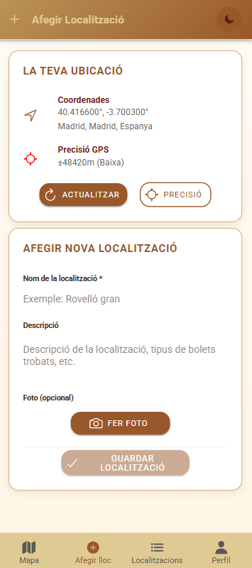
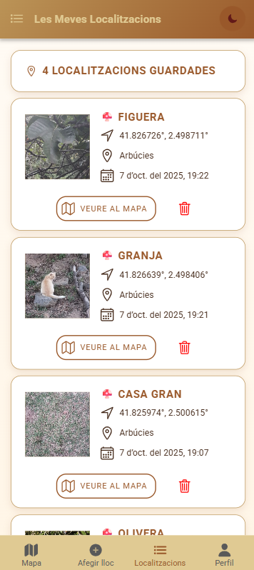

# 🍄 Mushroom Finder

<p align="center">
  
</p>
<table>
  <tr>
    <td></td>
    <td></td>
    <td></td>
  </tr>
</table>

## 🚀 PWA: Instal·la-la al teu dispositiu

**Prova-la i instal·la-la directament des d'aquesta adreça:**

👉 [https://boletus-eb305.web.app](https://boletus-eb305.web.app)

Aplicació preparada com a Progressive Web App (PWA):

- Pots instal·lar-la al mòbil o ordinador des del navegador (icona de descàrrega).
- Funciona offline, amb service worker i manifest configurats.
- Experiència nativa: icona, splash, mode fosc automàtic.

---

Aplicació híbrida moderna per descobrir, guardar i compartir ubicacions de bolets amb mapa, fotos, temps i autenticació.


### Funcionalitats

- Mapa interactiu amb Google Maps
- Gestió de localitzacions amb fotos i coordenades
- Previsió meteorològica en temps real
- Autenticació i base de dades amb Firebase
- Captura de fotos amb la càmera
- Mode clar/fosc automàtic
- **Notificacions de proximitat:**
  - L'app detecta si l'usuari està a menys de 100m d'una ubicació guardada i mostra una notificació local amb el nom de la ubicació.
  - La ubicació de l'usuari es llegeix periòdicament amb l'API de geolocalització.
  - Les ubicacions es recuperen de Firestore i es compara la distància amb la ubicació actual.
  - Si s'està a prop, es mostra una notificació local automàticament.

### Stack

- Ionic React + TypeScript
- Vite
- Firebase (Firestore, Auth, Storage, Hosting)
- Google Maps API
- OpenWeather API

### Instal·lació

```bash
git clone <repo>
cd mushroom-finder
npm install
npm run dev
```

### Build i desplegament

```bash
npm run build
npx serve dist
```

- **Geolocation Hook**: Custom useGeolocation hook with high accuracy default

### Performance & Optimization

- **Code Splitting**: Dynamic imports with React.lazy for pages
- **Bundle Optimization**: Manual chunking (React, Firebase, Vendor, Pages)
- **Build Optimization**: Terser minification with console removal
- **Caching**: Optimized Firebase Hosting cache headers

### Mobile Development

- **Hybrid Framework**: [Capacitor](https://capacitorjs.com/) v7.4.3
- **Native Features**: Haptics, Status Bar, Keyboard integration

### Development Tools

- **Testing**: Cypress (E2E), Vitest (Unit), Testing Library
- **Linting**: ESLint with TypeScript support
- **Code Quality**: TypeScript v5.1.6 with strict configuration

## 📁 Project Structure

```text
mushroom-finder/
├── src/
│   ├── components/          # Reusable UI components
│   │   ├── AuthGuard.tsx   # Route protection component
│   │   ├── ThemeToggle.tsx # Theme switcher component
│   │   ├── SectionHeader.tsx # Unified page header with title and theme toggle
│   │   ├── DeleteButton.tsx # Generic reusable delete button with confirmation
│   │   ├── PhotoManager.tsx # Photo capture and management component
│   │   ├── WeatherInfo.tsx # Weather display with mushroom forecast
│   │   ├── LocationListCard.tsx # Location card component with navigation
│   │   ├── AddLocationForm.tsx # Location creation form component
│   │   └── MapView.tsx     # Google Maps wrapper component
│   ├── contexts/           # React Context providers
│   │   ├── AuthContext.tsx # Authentication state management
│   │   ├── ThemeContext.tsx # Theme management provider
│   │   └── theme.ts        # Theme types and interfaces
│   ├── pages/              # Main application screens (lazy loaded)
│   │   ├── Map.tsx         # Google Maps with mushroom markers
│   │   ├── AddLocation.tsx # Location creation page with photo & geolocation
│   │   ├── LocationsList.tsx # Location management list
│   │   ├── LocationDetail.tsx # Detailed location view with weather
│   │   ├── Profile.tsx     # User profile management
│   │   └── Login.tsx       # Authentication page
│   ├── routes/             # Application routing
│   │   └── routes.tsx      # Lazy-loaded route configuration
│   ├── services/           # API and external services
│   │   ├── firestoreService.ts # Complete Firestore CRUD operations
│   │   ├── googleMapsService.ts # Google Maps integration
│   │   ├── weatherService.ts # OpenWeather API integration
│   │   ├── geocodingService.ts # Reverse geocoding service
│   │   ├── photoService.ts # Photo upload and management
│   │   └── authService.ts  # Firebase authentication
│   ├── hooks/              # Custom React hooks
│   │   └── useGeolocation.ts # High-accuracy geolocation hook
│   ├── types/              # TypeScript type definitions
│   │   ├── location.ts     # Location interfaces and types
│   │   ├── weather.ts      # Weather data interfaces
│   │   └── user.ts         # User profile interfaces
│   ├── styles/             # Global styling
│   │   ├── globals.css     # Global light theme styles
│   │   └── globals-dark.css # Global dark theme styles
│   ├── theme/              # Ionic theming
│   │   └── variables.css   # Ionic CSS custom properties
│   └── config/             # Configuration files
│       └── firebase.ts     # Firebase initialization
├── public/                 # Static assets
│   ├── manifest.json       # PWA manifest
│   └── favicon.svg         # App icon
├── cypress/                # E2E testing configuration
├── firebase.json           # Firebase Hosting configuration
├── .firebaserc            # Firebase project configuration
├── .env.example           # Environment variables template
├── vite.config.ts         # Optimized Vite configuration
└── dist/                  # Optimized build output (chunked)
```

## 🛠️ Installation

### Prerequisites

- Node.js 18+ and npm
- Firebase project with Firestore, Authentication, and Storage enabled
- Google Maps API key with Maps JavaScript API enabled
- OpenWeather API key (free tier available)
- (Optional) Android Studio or Xcode for native development

### Setup Steps

1. **Clone the repository**

   ```bash
   git clone https://github.com/GeorginaTS/boletus.git
   cd mushroom-finder
   ```

2. **Install dependencies**

   ```bash
   npm install
   ```

3. **Environment Configuration**

   Copy `.env.example` to `.env` and fill in your API keys:

   ```bash
   cp .env.example .env
   ```

   Required environment variables:

   ```bash
   # Google Maps API Key
   VITE_GOOGLE_MAPS_API_KEY=your_google_maps_api_key_here

   # OpenWeather API Key (free tier: 1000 calls/day)
   VITE_OPENWEATHER_API_KEY=your_openweather_api_key_here

   # Firebase Configuration
   VITE_FIREBASE_API_KEY=your-api-key
   VITE_FIREBASE_AUTH_DOMAIN=your-project.firebaseapp.com
   VITE_FIREBASE_PROJECT_ID=your-project-id
   VITE_FIREBASE_STORAGE_BUCKET=your-project.appspot.com
   VITE_FIREBASE_MESSAGING_SENDER_ID=123456789
   VITE_FIREBASE_APP_ID=your-app-id
   ```

4. **Firebase Configuration**

   Ensure your Firebase project has:
   - ✅ Firestore Database enabled
   - ✅ Authentication enabled (Email/Password)
   - ✅ Storage enabled (for photos)
   - ✅ Hosting configured (optional, for deployment)

5. **Start development server**

   ```bash
   npm run dev
   ```

6. **Access the application**
   Open [http://localhost:5173](http://localhost:5173) in your browser

### 🗺️ Google Maps API Setup

1. **Get API Key**: Visit [Google Cloud Console](https://console.cloud.google.com/google/maps-apis/)
2. **Enable APIs**:
   - Maps JavaScript API
   - Advanced Markers API
   - Geocoding API
3. **Set Restrictions**: Configure API key restrictions for security
4. **Add to .env**: Add your API key to `VITE_GOOGLE_MAPS_API_KEY`

### 🌦️ OpenWeather API Setup

1. **Create Account**: Visit [OpenWeather](https://openweathermap.org/api)
2. **Sign Up**: Free tier includes 1,000 calls/day
3. **Generate Key**: Get your API key from [API Keys page](https://home.openweathermap.org/api_keys)
4. **Add to .env**: Add your API key to `VITE_OPENWEATHER_API_KEY`
5. **Wait**: New API keys may take ~10 minutes to activate

> **Note**: This project uses Tailwind CSS v3.4.x with CommonJS configuration files (`tailwind.config.cjs` and `postcss.config.cjs`) to ensure compatibility with ES modules.

## 📱 Building for Mobile

### Android Build

```bash
npm run build
npx cap add android
npx cap sync android
npx cap open android
```

### iOS Build

```bash
npm run build
npx cap add ios
npx cap sync ios
npx cap open ios
```

## 🧪 Testing

### Unit Tests

```bash
npm run test.unit
```

### End-to-End Tests

```bash
npm run test.e2e
```

### Linting

```bash
npm run lint
```

## 🎨 Theming & Styling

The application features a comprehensive theme system with earth-toned colors inspired by nature and mushrooms:

### Theme System

- **Dynamic Theme Switching**: Seamless light/dark mode toggle with persistent user preferences
- **System Preference Detection**: Automatically detects and applies user's OS theme preference
- **Context-Based Management**: React Context API for global theme state
- **LocalStorage Persistence**: Theme preferences saved across sessions
- **Ionic Integration**: Synchronized with Ionic's native dark mode classes

### Color Palette

The app uses a nature-inspired color system with custom CSS variables:

#### Light Mode Colors

- **Primary (Brown)**: `#99582a` - Main brand color, mushroom caps
- **Secondary (Lion)**: `#bb9457` - Golden tones, highlights
- **Tertiary (Peach)**: `#ffe6a7` - Soft accents, backgrounds
- **Bistre**: `#432818` - Dark brown text and accents
- **Background**: `#fffbf3` - Warm peach tone

#### Dark Mode Colors

- **Background**: Dark gray gradients with subtle transparency
- **Text**: Golden lion tones for readability
- **Accents**: Muted earth tones for contrast

### Theme Implementation

```typescript
// Using the theme hook
import { useTheme } from '@/hooks/useTheme';

const { theme, toggleTheme, setTheme } = useTheme();

// Toggle between light/dark
<IonButton onClick={toggleTheme}>
  <IonIcon icon={theme === 'dark' ? sunny : moon} />
</IonButton>
```

### CSS Architecture

- **CSS Custom Properties**: Centralized design tokens in `src/theme/variables.css`
- **Global Styles**: Shared styles in `src/styles/globals.css` and `globals-dark.css`
- **Component Styles**: Minimal, component-specific CSS co-located with components
- **Responsive Design**: Mobile-first approach with Ionic utilities
- **Gradient Backgrounds**: Custom linear gradients for TabBar and headers
- **Class Reuse**: Maximum reuse of global CSS classes to minimize code duplication

### CSS Best Practices

This project follows strict CSS organization principles:

1. **Global First**: Use existing global classes (`.card-info`, `.info-section`, `.form-actions`, etc.)
2. **Minimal Components**: Component CSS files only contain unique, component-specific styles
3. **No Duplication**: Avoid recreating styles that already exist globally
4. **Dark Theme**: Use `.dark-theme` class prefix, NOT media queries for dark mode
5. **Ionic Classes**: Leverage built-in Ionic classes (`.ion-text-center`, `.ion-padding`, etc.)

Example:

```css
/* ✅ GOOD - Minimal component CSS (WeatherInfo.css: ~53 lines) */
.temp-value {
  font-size: 3.5rem;
  font-weight: 700;
  color: var(--lion);
}

/* ❌ BAD - Recreating global styles */
.weather-card-info-item {
  /* Don't recreate .card-info-item styles */
}
```

## 🧩 Component Architecture

### Reusable Components

- **DeleteButton**: Generic delete with confirmation (used in LocationListCard, PhotoManager, LocationDetail)
- **PhotoManager**: Photo capture/preview/delete UI with Capacitor Camera
- **WeatherInfo**: Weather display with mushroom forecast (only ~53 lines of CSS!)
- **SectionHeader**: Page header with title and theme toggle
- **LocationListCard**: Clickable location card with navigation
- **MapView**: Google Maps wrapper with advanced markers

### Key Services

- **weatherService**: OpenWeather API + mushroom condition scoring algorithm
- **firestoreService**: Complete CRUD operations for locations
- **photoService**: Firebase Storage integration with compression
- **googleMapsService**: Maps initialization, markers, terrain toggle
- **geocodingService**: Reverse geocoding (coordinates → city name)

### Design Principles

1. **Single Responsibility** - Each component has one clear purpose
2. **Props Over State** - Configuration via props and callbacks
3. **Global CSS First** - Maximize reuse of `.card-info`, `.info-section`, `.form-actions`
4. **Minimal Component CSS** - Only unique styles (e.g., WeatherInfo: 53 lines vs 233!)
5. **TypeScript Strict** - Full typing for all props and state

## 🗺️ Geolocation Features

### Core Functionality

- **High-Accuracy Positioning**: Enhanced GPS precision for outdoor use
- **Web Compatibility**: Fallback support for browser-based geolocation
- **Automatic Storage**: Real-time location persistence to user profiles
- **Visual Feedback**: Interactive maps with accuracy circles and markers

### Location Services Architecture

```typescript
// Geolocation Hook Usage
const { location, loading, error, getCurrentLocation } = useGeolocation(true);

// Manual location refresh
const handleLocationUpdate = useCallback(() => {
  getCurrentLocation();
}, [getCurrentLocation]);
```

### Automatic Zoom & Bounds

- **Smart Map Fitting**: Automatically adjusts zoom to include user location and all saved locations
- **Dynamic Bounds Calculation**: Uses Google Maps LatLngBounds for optimal viewing
- **User-Centric Zoom**: Prioritizes user's current position in view calculations
- **Responsive Adjustment**: Adapts to different screen sizes and location densities

## 🌦️ Weather & Mushroom Forecasting

Real-time weather integration using OpenWeather API with intelligent mushroom hunting predictions.

### Mushroom Condition Scoring (0-100)

The app analyzes weather conditions and scores them for optimal mushroom hunting:

- **Humidity (35 pts)**: 70-95% ideal, 60-69% acceptable
- **Temperature (30 pts)**: 10-25°C ideal, 5-30°C acceptable  
- **Precipitation (20 pts)**: Recent rainfall is excellent
- **Cloud Coverage (15 pts)**: 30-80% ideal, >80% acceptable

Score 60+ = Good conditions ✓

### Weather Data Displayed

Temperature, humidity, wind, clouds, precipitation, city name, and visual weather emoji.

### API Info

- **Provider**: OpenWeather Current Weather API v2.5
- **Free Tier**: 1,000 calls/day
- **Language**: Catalan (ca)
- **Units**: Metric (°C, m/s)

## 🔐 Authentication & User Management

### Features

- Email/password authentication via Firebase Auth
- User profile creation and management
- Protected routes with AuthGuard component
- Persistent session management
- Profile data synchronization with Firestore

### User Profile Schema

```typescript
interface UserProfile {
  uid: string;
  email: string;
  displayName: string;
  city?: string;
  country?: string;
  latitude?: number;
  longitude?: number;
  lastLocationUpdate?: Date;
  createdAt: Date;
  updatedAt: Date;
}
```

## 📊 Database Structure

### Firestore Collections

- **users**: User profiles with location data
- **locations**: Mushroom finding spots with coordinates, descriptions, and metadata
- **findings**: User mushroom discoveries (future feature)

### Firebase Storage Structure

- **locations/**: Photo storage organized by location ID
  - `{locationId}.jpg`: Individual location photos with optimized compression
- **Security Rules**: Authenticated access with proper CORS configuration
- **File Management**: Automatic cleanup and size optimization

## 🚀 Deployment

### Firebase Hosting (Production)

The application is deployed to Firebase Hosting with optimized performance:

**Live Application**: [https://boletus-eb305.web.app](https://boletus-eb305.web.app)

```bash
# Build optimized production version
ionic build --prod

# Deploy to Firebase Hosting
firebase deploy --only hosting
```

### Build Optimization Features

- **Code Splitting**: Pages loaded dynamically with React.lazy()
- **Manual Chunking**: Separated vendor libraries (React, Firebase, Google Maps)
- **Terser Minification**: Compressed JavaScript with console.log removal
- **Optimized Caching**: Firebase Hosting cache headers for static assets

### Build Output Analysis

```bash
# Production build creates optimized chunks:
dist/assets/react-*.js        (~256kB) # React & React DOM
dist/assets/firebase-*.js     (~495kB) # Firebase services  
dist/assets/vendor-*.js       (~500kB) # Third-party libraries
dist/assets/pages-*.js        (~15kB)  # Application pages (lazy loaded)
dist/assets/services-*.js     (~17kB)  # Application services
dist/assets/components-*.js   (~5kB)   # UI components
```

### Firebase Configuration

- **Hosting**: Single Page Application (SPA) configuration
- **Rewrites**: Client-side routing support for Ionic React
- **Cache Headers**: Optimized for static assets and dynamic content
- **Build Directory**: `dist` (Vite build output)

### PWA Features

- Service worker support
- Offline capability  
- App manifest for home screen installation
- Progressive loading with code splitting

## 🤝 Contributing

1. Fork the repository
2. Create a feature branch (`git checkout -b feature/amazing-feature`)
3. Follow the coding guidelines in `docs/copilot-instructions.md`
4. Commit your changes (`git commit -m 'Add amazing feature'`)
5. Push to the branch (`git push origin feature/amazing-feature`)
6. Open a Pull Request

### Development Guidelines

- Use global CSS classes from `variables.css` before creating component-specific styles
- Follow TypeScript strict typing conventions
- Write unit tests for new functionality
- Maintain the nature-inspired design theme

## 🐛 Known Issues

- Location services require HTTPS in production for web deployment
- iOS requires location permissions configuration in Info.plist
- Some older Android devices may have reduced GPS accuracy

## 🍄 Application Pages

- **Map** (`/map`): Interactive Google Maps with mushroom markers, terrain toggle, fit bounds
- **Add Location** (`/add-location`): Create locations with photo capture, auto-geolocation, reverse geocoding
- **Locations List** (`/locations`): View/manage all locations with clickable cards
- **Location Detail** (`/location/:id`): Full details with weather forecast, photos, map navigation, delete option
- **Profile** (`/profile`): User account management and location info
- **Login** (`/login`): Firebase authentication

## 🍄 Location Management System

### Location Data Structure

```typescript
interface Location {
  id: string;
  name: string;
  description: string;
  lat: number;
  lng: number;
  createdAt: Date;
  updatedAt: Date;
  userId: string;
}
```

### Photo Service Integration

```typescript
// Photo upload with location-based naming
await uploadPhotoForLocation(locationId, photoDataUrl);

// Photo retrieval for display
const photoUrl = await getPhotoUrl(locationId);
```

### User Interface

- **Map Page**: Google Maps with click-to-add functionality, automatic zoom, and user location tracking
- **Add Location Page**: Form-based location creation with camera photo capture and validation
- **Locations List Page**: ModularLocationCard components with visible action buttons
- **Photo Integration**: Camera capture, preview, and automatic upload functionality
- **Enhanced UX**: Always-visible actions, improved loading states, and intuitive navigation
- **Responsive Design**: Optimized for both mobile and desktop experiences

### Technical Implementation

- **Google Maps Integration**: Advanced markers with custom styling and automatic bounds fitting
- **Firestore Service**: Comprehensive database operations with error handling
- **Firebase Storage**: Cloud photo storage with location-based file organization
- **Camera Integration**: Native camera functionality via Capacitor API
- **Real-time Updates**: Live synchronization across all application instances
- **Performance Optimization**: Lazy loading, efficient data fetching, and component modularity

## 📸 Photo Management

- **Capacitor Camera API**: Native photo capture with quality 80, DataUrl result
- **Firebase Storage**: Location-based naming (`locations/{locationId}.jpg`)
- **PWA Elements**: Browser camera support for web compatibility
- **Preview & Upload**: Instant preview, automatic upload after location creation

## 🎛️ Component Architecture

### Core Components

- **SectionHeader**: Unified page header with icon, title, and theme toggle
- **DeleteButton**: Generic delete button with confirmation dialog
- **PhotoManager**: Camera capture with preview and Firebase upload
- **WeatherInfo**: Real-time weather with mushroom forecast
- **LocationListCard**: Location display with navigation actions
- **AddLocationForm**: Location creation with validation
- **MapView**: Google Maps wrapper with custom markers

## � Deployment

### Google Play Store

Per publicar l'aplicació a Google Play Store, segueix la guia completa:

📖 **[Guia de Publicació a Google Play Store](docs/GOOGLE_PLAY_DEPLOYMENT.md)**

La guia inclou:

- Configuració de comptes i eines
- Generació de keystore i signatura
- Creació d'AAB (Android App Bundle)
- Materials de marketing (screenshots, icones, descripcions)
- Process de pujada i revisió
- Actualitzacions futures

**Scripts d'ajuda:**

```bash
# Windows PowerShell
.\build-release.ps1

# Linux/Mac
./build-release.sh
```

## �🔮 Roadmap

- [ ] Mushroom species database and identification
- [ ] Offline map caching and location storage
- [ ] Social features for sharing discoveries
- [ ] Advanced filtering and search
- [ ] GPS track recording for foraging routes
- [ ] Push notifications for nearby discoveries

## 📄 License

This project is licensed under the MIT License - see the [LICENSE](LICENSE) file for details.

## ⚡ Performance Optimizations

### Build Optimizations

- **Code Splitting**: Dynamic imports with React.lazy() for all pages
- **Manual Chunking**: Strategic separation of vendor libraries
- **Bundle Analysis**: Optimized chunk sizes under warning thresholds
- **Minification**: Terser optimization with production-ready output

### Loading Performance

- **Lazy Loading**: Pages load only when accessed
- **Suspense Loading**: Smooth loading states with spinner feedback  
- **Efficient Caching**: Firebase Hosting optimized cache headers
- **Reduced Bundle Size**: Separated chunks for better cache utilization

### Runtime Performance

- **Google Maps Optimization**: Efficient marker management and API usage
- **Firestore Optimization**: Batched operations and real-time listeners
- **React Optimization**: Proper component lifecycle and state management

## 🙏 Acknowledgments

- [Ionic Framework](https://ionicframework.com/) for the excellent hybrid development platform
- [Firebase](https://firebase.google.com/) for comprehensive backend services, hosting, and storage
- [Google Maps](https://developers.google.com/maps) for advanced mapping capabilities and automatic zoom features
- [Capacitor](https://capacitorjs.com/) for native camera integration and cross-platform functionality
- [PWA Elements](https://github.com/ionic-team/pwa-elements) for web camera support and compatibility
- [Vite](https://vitejs.dev/) for fast build tooling and optimization features
- [React](https://reactjs.org/) for the robust component architecture
- Nature photographers and mushroom enthusiasts for inspiring the application concept

## 📞 Support

For support and questions:

- Create an issue in the GitHub repository
- Contact the development team
- Check the documentation in the `docs/` folder

---

Happy Mushroom Hunting! 🍄🌲
